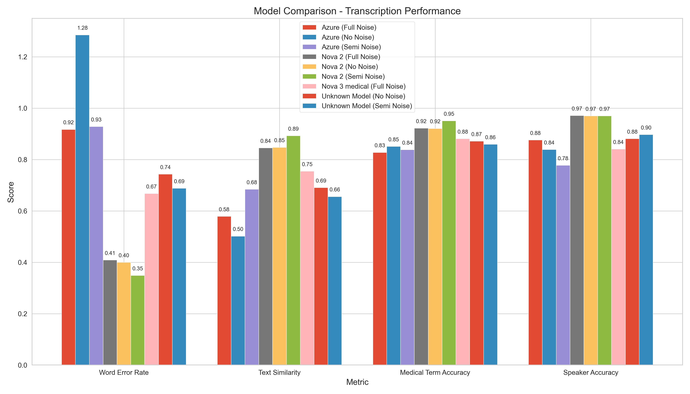
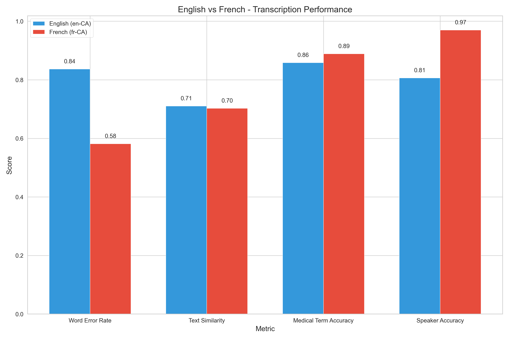
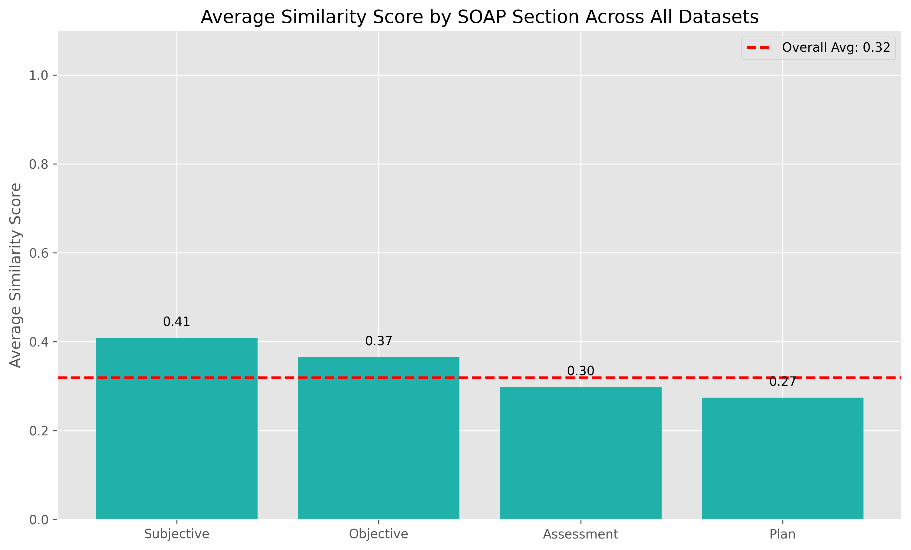

# Medical Speech-to-Text Evaluation Framework

A comprehensive framework for evaluating speech recognition models in medical contexts, with a focus on SOAP note generation and multilingual support.

## Table of Contents
- [Overview](#overview)
- [Key Findings](#key-findings)
- [Project Structure](#project-structure)
- [Getting Started](#getting-started)
- [Data Generation Pipeline](#data-generation-pipeline)
- [Evaluation Framework](#evaluation-framework)
- [SOAP Note Analysis](#soap-note-analysis)
- [Visualization and Reporting](#visualization-and-reporting)
- [Contributing](#contributing)

## Overview

This project provides a scientific framework for evaluating speech-to-text models in medical environments. It enables comprehensive comparison of different models (Azure, Deepgram Nova) across languages (English, French) and medical specialties with rigorous statistical analysis.

The framework includes a complete pipeline for:
- Generating synthetic medical conversations
- Converting text to speech with various noise levels
- Transcribing audio with different STT models
- Evaluating performance across multiple metrics
- Generating SOAP notes from transcriptions
- Visualizing and reporting results

## Key Findings



Our rigorous scientific evaluation revealed:

1. **Model Performance**:
   - Nova-3-medical achieves superior performance for English medical content
   - Nova-2 demonstrates exceptional performance for French medical content
   - Azure provides good general transcription but lags in medical term recognition

2. **Medical Terminology Recognition**:
   - Nova-3-medical: 87.1% F1 score for English medical terms
   - Nova-2: 91.4% F1 score for French medical terms
   - All models struggle most with medication names and complex multi-syllabic terms

3. **Noise Impact**:
   - Nova-2 shows remarkable resilience to noise for French content
   - Semi-noise conditions often yield optimal performance with Deepgram models
   - Azure shows steeper performance degradation as noise increases

4. **SOAP Note Analysis**:
   - Subjective sections achieve highest transcription accuracy (0.41)
   - Assessment sections are most challenging (0.30)
   - Plan sections show critical clinical information gaps (0.27)

5. **Speaker Diarization**:
   - Nova-3-medical achieves 78-88% speaker accuracy for English
   - Content-based speaker separation substantially improves French diarization
   - All models struggle with rapid speaker exchanges and overlapping speech

## Project Structure

```
medical-stt-evaluation/
├── README.md                     # Project documentation
├── requirements.txt              # Project dependencies
├── setup.py                      # Package installation
├── setup.sh                      # Environment setup script
├── .env.example                  # Example environment variables (no secrets)
│
├── src/                          # Source code
│   ├── pipeline/                 # Data generation pipeline components
│   │   ├── generate_medical_conversations.py
│   │   ├── convert_to_speech.py
│   │   ├── convert_to_speech_noisy.py
│   │   ├── transcribe_conversations.py
│   │   ├── transcribe_conversations_opposite.py
│   │   ├── soap_generation.py
│   │   └── run_pipeline.py       # Main pipeline orchestration
│   │
│   ├── evaluation/               # Evaluation modules
│   │   ├── metrics.py            # Evaluation metrics
│   │   ├── evaluator.py          # Main evaluation logic
│   │   └── statistical_tests.py  # Statistical analysis
│   │
│   ├── visualization/            # Visualization code
│   │   ├── plots.py              # Plot generation
│   │   └── report_generator.py   # Report generation
│   │
│   └── utils/                    # Utility functions
│       ├── audio_utils.py        # Audio processing utilities
│       ├── nlp_utils.py          # NLP utilities
│       └── medical_terms.py      # Medical terminology processing
│
├── data/                         # Data directories
│   ├── raw/                      # Original conversation data
│   │   ├── audio/                # Audio files
│   │   └── transcripts/          # Reference transcripts
│   └── processed/                # Processed data
│       ├── english/              # English data
│       ├── french/               # French data
│       └── evaluation/           # Evaluation data
│
├── data-med/                     # Medical dataset
│   ├── cardiology/               # Cardiology specialty data
│   │   ├── en-CA/                # English-Canadian data
│   │   └── fr-CA/                # French-Canadian data
│   └── gp/                       # General Practice specialty data
│       ├── en-CA/                # English-Canadian data
│       └── fr-CA/                # French-Canadian data
│
├── results/                      # Results and outputs
│   ├── figures/                  # Visualization outputs
│   ├── tables/                   # Evaluation result tables
│   └── reports/                  # Generated reports
│
├── docs/                         # Documentation
│   └── Evaluation_Report.md      # Comprehensive scientific evaluation report
│
├── scripts/                      # Utility scripts
│   ├── process_data.py           # Data processing utilities
│   └── visualize_results.py      # Visualization utilities
│
└── evaluation/                   # Legacy evaluation directory
    └── comparative/              # Comparative evaluation results
```

## Getting Started

### Prerequisites

- Python 3.8+
- API keys for Azure Speech Services and Deepgram
- FFmpeg for audio processing

### Installation

1. Clone the repository:
   ```bash
   git clone https://github.com/yourusername/medical-stt-evaluation.git
   cd medical-stt-evaluation
   ```

2. Set up the environment using the setup script:
   ```bash
   chmod +x setup.sh
   ./setup.sh
   ```

3. Configure your API keys in `.env`:
   ```
   OPENAI_API_KEY=your_openai_key
   DEEPGRAM_API_KEY=your_deepgram_key
   AZURE_SPEECH_KEY=your_azure_key
   AZURE_SPEECH_REGION=canadacentral
   ```

### Running the Pipeline

The main pipeline can be run using:

```bash
# Run the complete pipeline
python run_pipeline.py --specialty cardiology --language en-CA --noise moderate

# Run specific components
python src/pipeline/generate_medical_conversations.py --specialty cardiology --language en-CA
python src/pipeline/convert_to_speech.py --input-dir data/raw/transcripts --noise-level moderate
python src/pipeline/transcribe_conversations.py --model nova-3-medical --input-dir data/processed/audio
```

## Data Generation Pipeline

The pipeline consists of several components that can be run separately or as a complete workflow:

1. **Medical Conversation Generation**:
   - Generates realistic medical conversations using specialized models
   - Supports different specialties and languages
   - Creates structured JSON format with speaker turns and medical context

2. **Text-to-Speech Conversion**:
   - Converts text conversations to speech with realistic voice characteristics
   - Supports different noise levels (clean, semi-noise, noisy)
   - Generates both mono and stereo audio formats

3. **Speech-to-Text Transcription**:
   - Transcribes audio using specified STT models
   - Supports Azure Speech Services and Deepgram Nova models
   - Preserves speaker diarization information

4. **SOAP Note Generation**:
   - Generates structured SOAP notes from transcriptions
   - Extracts key medical information and organizes by section
   - Supports both English and French languages

## Evaluation Framework

The evaluation framework provides a comprehensive analysis of speech-to-text performance:

### Evaluation Metrics

- **Word Error Rate (WER)**: Levenshtein distance normalized by reference length
- **Medical Term F1 Score**: Precision and recall for medical terminology
- **Speaker Accuracy**: Correct attribution of speaker turns
- **Semantic Similarity**: TF-IDF cosine similarity between texts
- **BLEU Score**: N-gram precision with brevity penalty

### Running Evaluations

```bash
# Run comprehensive evaluation
python src/evaluation/evaluator.py --data-dir data/processed/evaluation --output-dir results

# Generate visualizations
python src/visualization/plots.py --data-file results/tables/evaluation_results.csv
```

## SOAP Note Analysis

SOAP note analysis provides insights into transcription performance by clinical section:

### Features

- **Section Detection**: Identification of Subjective, Objective, Assessment, and Plan sections
- **Section-Specific Metrics**: Performance analysis by SOAP section
- **Medical Term Extraction**: Identification and validation of medical terminology
- **Clinical Information Accuracy**: Assessment of clinically relevant information

### Running SOAP Analysis

```bash
# Generate SOAP notes from transcriptions
python src/pipeline/soap_generation.py --input-dir data/processed/transcripts

# Analyze SOAP note quality
python src/evaluation/soap_analyzer.py --input-dir data/processed/soap
```

## Visualization and Reporting

The framework includes tools for generating scientific visualizations and reports:

### Available Visualizations

1. **Model Performance Comparison**:
   

2. **Language Performance Analysis**:
   

3. **SOAP Section Analysis**:
   

4. **Noise Impact Analysis**:
   

5. **Medical Term Accuracy**:
   

### Generating Reports

A comprehensive scientific evaluation report is available at [docs/Evaluation_Report.md](docs/Evaluation_Report.md).

## Contributing

Contributions are welcome! Please feel free to submit a pull request or open an issue to discuss potential improvements.

### Development Guidelines

1. Follow PEP 8 style guidelines for Python code
2. Add unit tests for new functionality
3. Update documentation when adding or changing features
4. Maintain backward compatibility whenever possible 