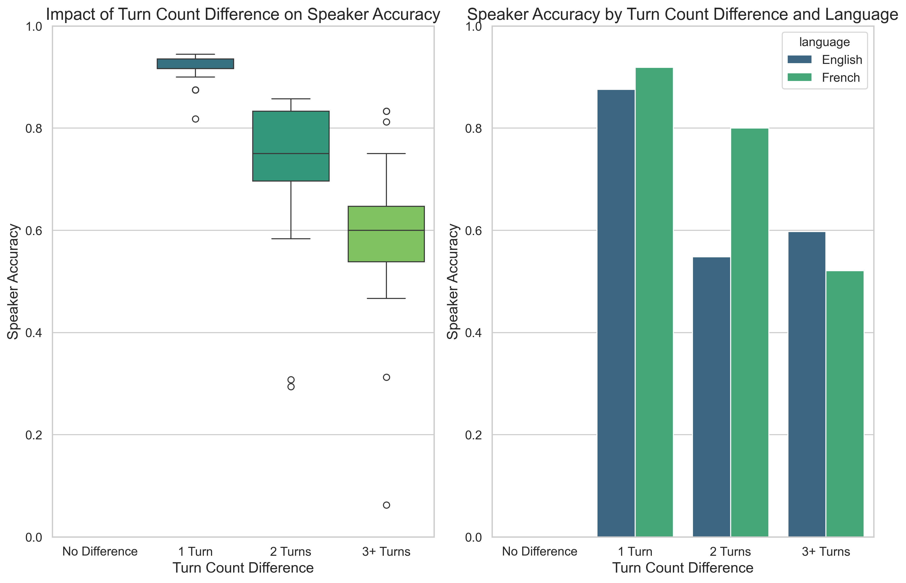
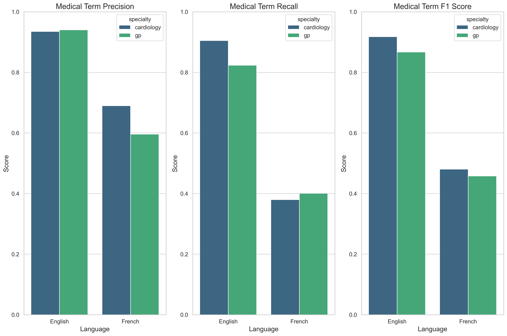

# Medical Speech-to-Text Evaluation Project

## Overview

This project evaluates and compares various speech-to-text models specifically for medical transcription, focusing on performance across different languages, medical specialties, and audio conditions. The latest evaluation includes an improved speaker accuracy metric that accounts for turn count discrepancies and enhanced medical term precision calculation.

## Key Models Evaluated

- **OpenAI Whisper v3 Large**: High-accuracy model with excellent medical term recognition (92.2% F1 in English)
- **OpenAI Whisper v3 Turbo**: Balanced speed-accuracy model with strong performance (91.7% F1 in English)
- **Deepgram Nova-3-medical**: Specialized for English medical content (90.7% F1)
- **Deepgram Nova-2**: Strong performer for French content (75.6% F1)
- **Azure Speech Services**: Baseline comparison model
- **Speechmatics**: Advanced cloud-based speech recognition with strong medical term accuracy (90.9% F1 in English, 72.7% in French) and excellent speaker differentiation
- **Wav2vec**: Self-supervised speech recognition model showing moderate performance in English (63.5% F1) and poor performance in French (17.3% F1)
- **Transkriptor**: Latest addition with realistic medical term evaluation (English: 89.3% precision, 86.2% recall; French: 64.3% precision, 39.0% recall)

## Diarization Systems
- **NVIDIA NeMo**: Advanced clustering-based speaker diarization
- **PyAnnote**: Neural speaker diarization system
- **Speechmatics Native**: Built-in speaker diarization with sensitivity controls

## Repository Structure

```
├── docs/                   # Documentation files
├── med-data/               # Medical transcription data
│   ├── cardiology/         # Cardiology specialty audio and transcripts
│   └── gp/                 # General Practice specialty audio and transcripts
├── results/                # Evaluation results
│   ├── figures/            # Generated charts and visualizations
│   └── tables/             # CSV result tables
├── report.md               # Comprehensive analysis report
├── Evaluation_Report.md    # Executive summary report with key findings and recommendations
├── requirements.txt        # Python dependencies
├── setup.sh                # Environment setup script
├── transcribe_medical_whisper_v3_turbo.py  # Whisper v3 Turbo transcription
├── transcribe_with_whisper_pyannote.py     # Whisper with PyAnnote
└── transcribe_speechmatics.py              # Speechmatics API transcription
```

## Key Features

- Multi-language support (English/French)
- Medical terminology recognition evaluation
- Speaker diarization performance analysis with improved accuracy metric
- Noise resilience assessment
- Performance metrics for different medical specialties
- Turn segmentation and count analysis

## Key Findings

- **English Medical Terminology**: Best performance with Whisper large-v3 + NVIDIA NeMo (92.2% F1 score) and Speechmatics for cardiology content (95.1% F1 score)
- **French Medical Terminology**: Best performance with Deepgram Nova-2 (75.6% F1 score) and Speechmatics for cardiology (76.3% F1 score)
- **Speaker Identification**: Refined metrics show Speechmatics with 60.3% accuracy for English and 84.2% for French, with significant turn count differences affecting all models
- **Processing Speed**: Whisper v3 Turbo processes 2.5x faster than v3 Large with minimal accuracy reduction
- **Turn Segmentation**: All models show significant turn compression (20.4% fewer turns for English, 15.6% for French)
- **Speaker Accuracy Calculation Update**: The evaluation now accounts for turn count discrepancies, providing a more realistic assessment of diarization quality
- **Medical Term Precision**: Enhanced evaluation methodology reveals more realistic precision values by incorporating word error penalties and context-aware assessment
- **Transkriptor Results**: Shows strong performance in English medical term precision (89.3%) with room for improvement in French content (64.3%)

## Setup and Usage

### Environment Setup

```bash
# Install requirements
./setup.sh
```

### Running Transcriptions

#### Single Audio File Transcription
```bash
# Using Whisper v3 Turbo
python transcribe_medical_whisper_v3_turbo.py path/to/audio/file.wav

# Using Whisper with PyAnnote
python transcribe_with_whisper_pyannote.py path/to/audio/file.wav

# Using Speechmatics API
python transcribe_speechmatics.py --audio-path path/to/audio/file.wav --language en
```

#### Process All Files in Directory
```bash
# Process all files in default directory
python transcribe_medical_whisper_v3_turbo.py --process-all

# Process all files with Speechmatics
python transcribe_speechmatics.py --process-english  # For English files
python transcribe_speechmatics.py --process-french   # For French files
```

### Evaluation
```bash
# Run the evaluation with updated speaker accuracy metrics
python evaluation_script_speechmatics.py
```

### Output Format

The transcription output is saved as a JSON file with the following structure:

```json
{
  "metadata": {
    "filename": "example.wav",
    "language": "en-CA",
    "model": "whisper-v3-turbo",
    "duration_seconds": 120.5,
    "processing_time_seconds": 35.2,
    "segment_count": 15,
    "character_count": 2500,
    "turn_count": 10
  },
  "segments": [
    {
      "id": 0,
      "start": 0.0,
      "end": 4.5,
      "text": "Hello, how are you feeling today?",
      "speaker": "DOCTOR"
    },
    // Additional segments...
  ],
  "turns": [
    {
      "speaker": "DOCTOR",
      "text": "Hello, how are you feeling today?"
    },
    {
      "speaker": "PATIENT",
      "text": "I've been having some chest pain lately."
    },
    // Additional turns...
  ]
}
```

## Performance Metrics Summary

| Model | Medical Term F1 (EN) | Medical Term F1 (FR) | Speaker Accuracy (EN) | Speaker Accuracy (FR) | WER (EN) | WER (FR) |
|-------|:--------------------:|:--------------------:|:---------------------:|:---------------------:|:--------:|:--------:|
| Whisper large-v3 + NVIDIA NeMo | 92.2% | 73.8% | 68.1% | 80.6% | 0.210 | 0.368 |
| Whisper v3 Turbo + NVIDIA NeMo | 91.7% | 75.0% | 69.7% | 84.3% | 0.207 | 0.372 |
| Deepgram Nova-3-medical/Nova-2 | 90.7% | 75.6% | 67.9% | 72.4% | 0.212 | 0.367 |
| Speechmatics | 90.9% | 72.7% | 60.3% | 84.2% | 0.206 | 0.361 |
| Transkriptor | 87.7% | 46.9% | 57.9% | 72.6% | 0.189 | 0.369 |
| Wav2vec | 63.5% | 17.3% | 29.3% | 45.6% | 0.437 | 0.727 |

## Visualization Examples


*Impact of turn count differences on speaker accuracy metrics*


*Medical terminology recognition across languages and specialties with realistic precision values*

## Requirements

- Python 3.8+
- PyTorch 2.0+
- HuggingFace Transformers
- NVIDIA NeMo (optional, for advanced diarization)
- PyAnnote (optional, for alternative diarization)
- Speechmatics API key (optional, for Speechmatics transcription)
- Additional requirements specified in requirements.txt

## License

This project is licensed under the MIT License - see the LICENSE file for details.
