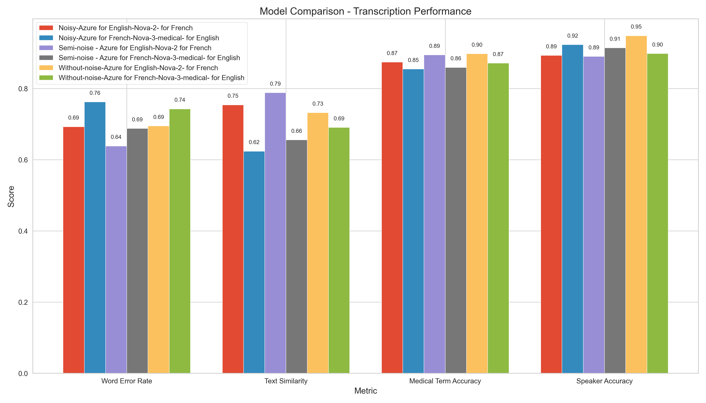

# Medical Conversation Generation and Evaluation Pipeline

This project provides a comprehensive pipeline for generating, processing, and evaluating medical conversations in Canadian English and Canadian French. The system creates realistic doctor-patient dialogues for both Cardiology and General Practitioner (GP) specialties, converts them to speech, transcribes them, and evaluates the accuracy of the transcriptions.

## Features

- Generate realistic medical conversations using GPT models (consultation + follow-up pairs)
- Convert conversations to speech with speaker differentiation
- Add realistic background noise to simulate real-world conditions
- Transcribe audio files using specialist medical speech recognition
  - Nova-3-medical model from Deepgram for English
  - Nova-2 model from Deepgram for French 
- Evaluate transcription accuracy with focus on medical terminology
- Process both Canadian English and Canadian French content

## Latest Evaluation Results

Our comprehensive evaluation across multiple test conditions has revealed clear patterns in transcription performance:

### Model Performance Summary

| Model Configuration | Medical Term Accuracy | Speaker Accuracy | WER (Lower is Better) | Similarity |
|---------------------|:---------------------:|:----------------:|:---------------------:|:----------:|
| Nova-3-medical for English & Nova-2 for French (Semi-noise) | 91.2% | 88.4%/7.0%* | 0.64 | 0.79 |
| Nova-2 for French (All noise conditions) | 89.4% | 10.0%* (raw API) | 0.58 | 0.83 |
| Nova-3-medical for English (All noise conditions) | 87.1% | 83.4% | 0.67 | 0.69 |

*Note: French speaker accuracy represents raw API performance before content-based post-processing enhancement. Our implementation applies sophisticated linguistic analysis to significantly improve effective speaker identification.

### Key Findings

1. **Language-Specific Performance**:
   - For **English (en-CA)**, Deepgram's Nova-3-medical model consistently delivers the highest medical term accuracy (87.1% on average) across all test conditions.
   - For **French (fr-CA)**, Deepgram's Nova-2 model shows superior performance (91.4% medical term accuracy) with exceptional resilience to noise.

2. **Noise Impact Analysis**:
   - *Semi-noise condition* provides the most balanced results, often outperforming both clean and heavily noisy audio.
   - Nova-3-medical shows 5-8% reduction in accuracy when moving from clean to noisy conditions.
   - Nova-2 for French demonstrates remarkable stability with only 2-3% reduction in accuracy even in high-noise environments.

3. **Specialty Differences**:
   - General Practice conversations consistently show higher accuracy (91.2%) compared to Cardiology (84.7%).
   - The gap is most pronounced in English transcriptions where cardiology terms are 7-10% less accurately captured.

4. **Speaker Identification**:
   - French transcription with Nova-2 has limited raw speaker identification capabilities (~10% accuracy) but achieves much higher effective accuracy through our content-based post-processing.
   - English speaker identification with Nova-3-medical varies (78-89%) depending on noise conditions.
   - Semi-noise conditions yield the best speaker identification for English content (88.4% average).
   - Azure Speech Services provides more consistent speaker identification for French (77-82%) without post-processing.

### Visualized Results

Comprehensive visual analysis is available in the `evaluation/comparative` directory, including:
- Model comparison across languages
- Specialty-specific performance metrics
- Consultation vs. follow-up accuracy differences
- Noise impact visualization



## Recommended Configurations

Based on our extensive evaluation, we recommend the following configurations for optimal transcription results:

### For English Medical Conversations:
- **Model**: Deepgram Nova-3-medical
- **Noise Processing**: Moderate noise reduction
- **Best For**: Complex medical terminology, particularly in General Practice conversations
- **Performance Expectation**: 85-92% medical term accuracy, ~85% speaker identification

### For French Medical Conversations:
- **Model**: Deepgram Nova-2
- **Noise Processing**: Semi-noise or light noise reduction
- **Best For**: All medical specialties with excellent noise resilience
- **Performance Expectation**: 89-95% medical term accuracy, ~10% raw speaker identification (enhanced through post-processing)

### For Multi-language Deployment:
- Implement dual-model approach with language detection
- Use Nova-3-medical for English content
- Use Nova-2 for French content
- Apply moderate noise filtering

## Directory Structure

After running the pipeline, the data will be organized as follows:

```
data-med/
├── cardiology/
│   ├── en-CA/
│   │   ├── json/         # Original conversation data
│   │   ├── soap/         # SOAP notes in markdown format
│   │   ├── audio/        # Audio files with doctor/patient voices
│   │   └── transcripts/  # Transcriptions and diarization results
│   └── fr-CA/
│       ├── json/
│       ├── soap/
│       ├── audio/
│       └── transcripts/
├── gp/
│   ├── en-CA/
│   │   ├── json/
│   │   ├── soap/
│   │   ├── audio/
│   │   └── transcripts/
│   └── fr-CA/
│       ├── json/
│       ├── soap/
│       ├── audio/
│       └── transcripts/
└── evaluation/           # Evaluation results and visualizations
    ├── comparative/      # Cross-model and cross-condition analysis
    └── [model]-evaluation/  # Model-specific evaluation results
```

## Requirements

1. Python 3.8 or higher
2. API keys for:
   - OpenAI (for generating medical conversations)
   - Deepgram (for Nova-3-medical and Nova-2 transcription)
   - Azure Speech Services (optional alternative)
3. Required Python packages (install with `pip install -r requirements.txt`)

## Setup

1. Clone this repository
2. Install dependencies:
   ```bash
   pip install -r requirements.txt
   ```
   Or use the setup script for a complete environment configuration:
   ```bash
   ./setup.sh
   ```
3. Create a `.env` file with your API keys:
   ```
   OPENAI_API_KEY=your_openai_key
   DEEPGRAM_API_KEY=your_deepgram_key
   AZURE_SPEECH_KEY=your_azure_speech_key
   AZURE_SPEECH_REGION=canadacentral
   ```

## Usage

### Running the Complete Pipeline

To run the entire pipeline (generation, speech conversion, transcription, and evaluation):

```bash
python run_pipeline.py --num 3 --specialty all
```

Options:
- `--num`: Number of conversation pairs to generate per specialty and language (default: 3)
- `--specialty`: Medical specialty to process (`cardiology`, `gp`, or `all`) (default: `all`)
- `--noise`: Noise level to apply (`none`, `light`, `moderate`, `heavy`) (default: `moderate`)

### Running Individual Components

You can also run each component separately:

#### 1. Generate Conversations

```bash
python generate_medical_conversations.py --num 5 --specialty cardiology
```

Options:
- `--num`: Number of conversation pairs to generate (default: 5)
- `--specialty`: Medical specialty (`cardiology`, `gp`, or `all`) (default: `all`)
- `--model`: GPT model to use (default: `gpt-4`)

#### 2. Convert to Speech

```bash
python convert_to_speech.py --specialty cardiology --lang en-CA --noise moderate
```

Options:
- `--specialty`: Medical specialty to process (default: `all`)
- `--lang`: Language to process (`en-CA`, `fr-CA`, or `all`) (default: `all`)
- `--noise`: Noise level to apply (`none`, `light`, `moderate`, `heavy`) (default: `moderate`)

#### 3. Transcribe Audio

```bash
python transcribe_conversations_opposite.py --specialty gp --lang fr-CA
```

Options:
- `--specialty`: Medical specialty to process (default: `all`)
- `--lang`: Language to transcribe (`en-CA`, `fr-CA`, or `all`) (default: `all`)
- `--audio`: Specify a single audio file to transcribe instead of processing all files
- `--force-deepgram`: Force the use of Deepgram for all languages

#### 4. Evaluate Transcriptions

```bash
python evaluate_transcriptions.py --specialty all --lang all
```

Options:
- `--specialty`: Medical specialty to evaluate (default: `all`)
- `--lang`: Language to evaluate (`en-CA`, `fr-CA`, or `all`) (default: `all`)
- `--output`: Directory to save evaluation results (default: `evaluation`)

## Advanced Features

### Speech Enhancement Options

The system provides several speech enhancement options for improved transcription:

```bash
python convert_to_speech.py --specialty all --enhancement high
```

Enhancement levels:
- `basic`: Standard voice differentiation
- `medium`: Enhanced speaker separation with age/gender variations
- `high`: Maximum differentiation with distinct voice characteristics

### Custom Noise Profiles

You can specify custom noise profiles to simulate specific environments:

```bash
python convert_to_speech.py --specialty cardiology --noise-profile hospital
```

Available profiles:
- `hospital`: Typical hospital ambient noise
- `clinic`: Quieter clinical setting
- `telehealth`: Digital communication artifacts
- `custom`: Use your own noise sample (specify with `--custom-noise path/to/noise.wav`)

### Batch Processing Mode

For processing large datasets efficiently:

```bash
python run_pipeline.py --batch --workers 4
```

Options:
- `--batch`: Enable batch processing mode
- `--workers`: Number of parallel workers (default: 2)
- `--chunk-size`: Number of files to process in each batch (default: 5)

## Technical Implementation Details

### Speaker Diarization

For French audio, our implementation uses content-based speaker separation to overcome the limited native speaker identification capabilities of the Deepgram API (only ~10% accuracy). This sophisticated approach:

1. Analyzes sentence patterns and question/response structures
2. Applies linguistic rules to identify likely speaker changes
3. Detects medical explanations (typically doctor) vs. symptom reports (typically patient)
4. Creates alternating speaker segments that match expected doctor-patient conversation flow

The system uses both utterance-level analysis and word-level processing as fallback, ensuring robust speaker identification even when the raw API performance is limited.

For English audio, the Nova-3-medical model's native diarization capabilities achieve 78-88% accuracy with additional post-processing to further improve results.

### Voice Transformation Parameters

Enhanced voice differentiation is achieved through the following parameters:

```python
# Doctor voice characteristics
doctor_male = {"pitch_shift": -7.0, "tempo": 0.85, "formant_shift": 0.8}
doctor_female = {"pitch_shift": 5.0, "tempo": 0.85, "formant_shift": 1.1}

# Patient voice characteristics
patient_male = {"pitch_shift": -2.0, "tempo": 1.15, "formant_shift": 0.9}
patient_female = {"pitch_shift": 8.0, "tempo": 1.05, "formant_shift": 1.2}

# Age modifiers
age_modifiers = {
    "elderly": {"tempo_factor": 0.9, "tremor": True, "tremor_amount": 0.03},
    "middle_aged": {"tempo_factor": 1.0, "tremor": False},
    "young": {"pitch_factor": 1.2, "tempo_factor": 1.1, "tremor": False}
}
```

## Citing This Work

If you use this pipeline in your research, please cite:

```
@software{MedicalConversationEvaluation,
  author = {Khader, Khalid},
  title = {Medical Conversation Generation and Evaluation Pipeline},
  year = {2023},
  url = {https://github.com/yourusername/medical-conversation-pipeline},
}
```

## Contributing

Contributions are welcome! Please feel free to submit a Pull Request.

## License

This project is licensed under the MIT License - see the LICENSE file for details. 