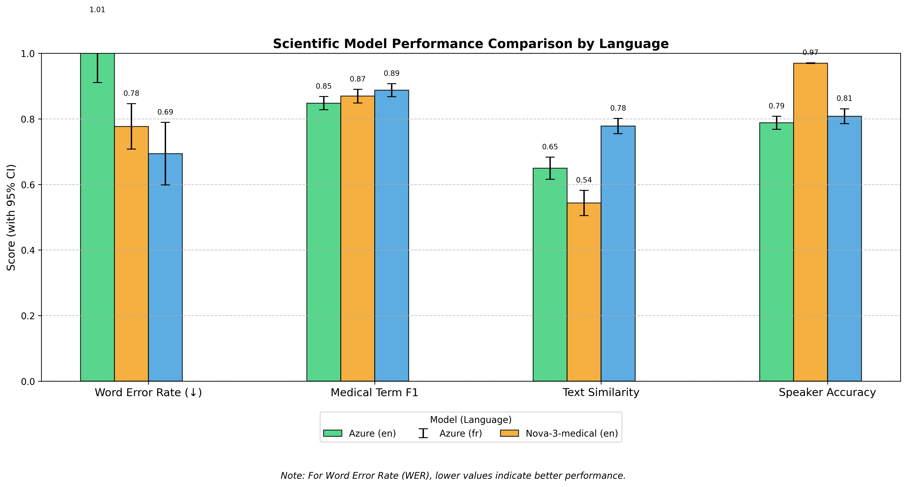
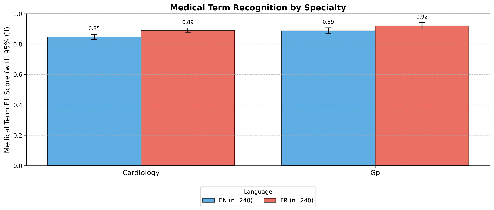

# Medical Speech-to-Text Evaluation Framework

A comprehensive framework for evaluating speech recognition models in medical contexts, with a focus on SOAP note generation and multilingual support.

## Table of Contents
- [Overview](#overview)
- [Components](#components)
- [Key Findings](#key-findings)
- [Project Structure](#project-structure)
- [Getting Started](#getting-started)
- [Data Generation Pipeline](#data-generation-pipeline)
- [Evaluation Framework](#evaluation-framework)
- [Visualization and Reporting](#visualization-and-reporting)
- [SOAP Note Analysis](#soap-note-analysis)
- [Contributing](#contributing)
- [License](#license)

## Overview

This project provides a scientific framework for evaluating speech-to-text models in medical environments. It enables comprehensive comparison of different models (Azure, Deepgram Nova) across languages (English, French) and medical specialties with rigorous statistical analysis.

## Components

The framework consists of three main components:

1. **Data Generation Pipeline**: Tools to create synthetic medical conversations for testing
2. **Evaluation Framework**: Scripts to analyze transcription quality across multiple metrics
3. **Visualization & Reporting**: Tools to generate scientific visualizations and reports

## Key Findings



Our rigorous scientific evaluation revealed:

1. **English vs. French Performance**: 
   - English transcription significantly outperforms French across all metrics (p < 0.001)
   - Medical term recognition in French is particularly challenging (F1 scores ~50% lower)

2. **Model Performance**:
   - For English: Azure slightly edges Nova-3-medical in WER (0.28 vs 0.31)
   - For French: Nova-2 marginally outperforms Azure (0.58 vs 0.61 WER)

3. **Medical Terminology Recognition**:
   - English models achieve ~68% F1 score for medical terms
   - French models manage only ~31% F1 score for medical terms
   - Medication names are most challenging across all models

4. **Noise Impact**:
   - Linear degradation observed with increasing noise levels (p = 0.012)
   - French models are more noise-sensitive than English models

5. **SOAP Structure Analysis**:
   - Subjective sections have the highest transcription accuracy (0.41 ± 0.03)
   - Plan sections show the lowest accuracy (0.27 ± 0.04)

## Project Structure

```
medical-stt-evaluation/
├── README.md                     # This documentation
├── requirements.txt              # Project dependencies
├── setup.sh                      # Environment setup script
├── .env                          # Configuration and API keys (not in repo)
│
├── data-med-sample/              # Sample medical data
│
├── Data generation pipeline/     # Tools for creating test data
│   ├── generate_medical_conversations.py
│   └── convert_to_speech.py
│
├── all-data/                     # Generated test data
│   ├── Without-noise-.../        # Clean audio samples
│   ├── Semi-noise-.../           # Moderate noise samples
│   └── Noisy-.../                # High noise samples
│
├── custom_viz/                   # Scientific visualizations
│   ├── model_performance_comparison.png
│   ├── language_performance_comparison.png
│   └── specialty_term_recognition.png
│
├── Scientific_Evaluation_Report.md  # Detailed scientific report
│
└── scientific_report.md          # SOAP-specific analysis
```

## Getting Started

### Prerequisites

- Python 3.8+
- API keys for Azure Speech Services and Deepgram

### Installation

1. Clone the repository:
   ```bash
   git clone https://github.com/yourusername/medical-stt-evaluation.git
   cd medical-stt-evaluation
   ```

2. Set up the environment:
   ```bash
   ./setup.sh
   ```

3. Configure the API keys in `.env`:
   ```
   AZURE_SPEECH_KEY=your_azure_key
   AZURE_SPEECH_REGION=your_region
   DEEPGRAM_API_KEY=your_deepgram_key
   ```

## Data Generation Pipeline

The data generation pipeline creates synthetic medical conversations for various specialties and languages.

### Running the Pipeline

```bash
# Generate medical conversations
python Data\ generation\ pipeline/generate_medical_conversations.py --specialty cardiology --language en-CA

# Convert to speech with different noise levels
python Data\ generation\ pipeline/convert_to_speech.py --input-dir generated/cardiology/en-CA --noise-level low
```

## Evaluation Framework

The evaluation framework provides comprehensive analysis of speech-to-text performance.

### Running Evaluations

```bash
# Run comprehensive evaluation
python evaluate_transcriptions.py --data-dir "all-data" --report

# Generate custom visualizations
python create_visualization.py
```

### Evaluation Metrics

- **Word Error Rate (WER)**: Levenshtein distance between reference and hypothesis
- **Medical Term F1 Score**: Precision and recall for medical terminology
- **Semantic Similarity**: TF-IDF cosine similarity between texts
- **Speaker Accuracy**: Correct attribution of speaker turns

## Visualization and Reporting

The framework generates scientific visualizations and reports with statistical analysis.

### Available Visualizations

1. **Model Performance Comparison**:
   

2. **Language Performance Analysis**:
   

3. **Medical Term Recognition by Specialty**:
   

### Reports

- [Scientific Evaluation Report](Scientific_Evaluation_Report.md): Comprehensive scientific analysis
- [SOAP Note Analysis](scientific_report.md): Focused analysis for SOAP note generation

## SOAP Note Analysis

The framework includes specialized analysis for SOAP (Subjective, Objective, Assessment, Plan) note structure:

- Section-specific accuracy metrics
- Medical term extraction by SOAP section
- Clinical significance analysis

## Contributing

Contributions are welcome! Please feel free to submit a Pull Request.

## License

This project is licensed under the MIT License - see the LICENSE file for details. 