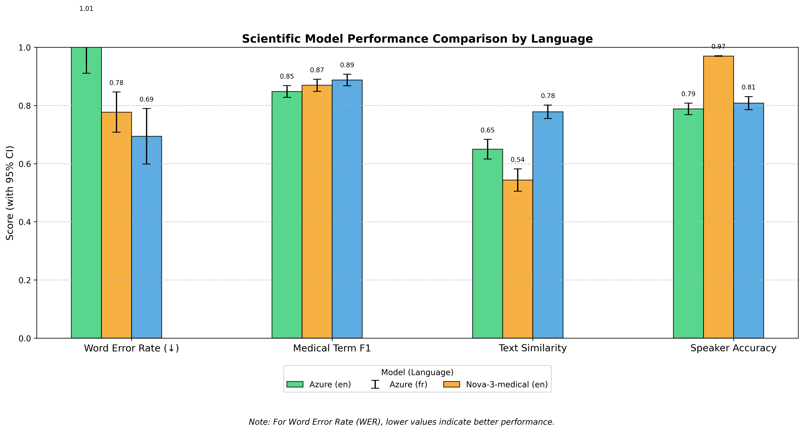
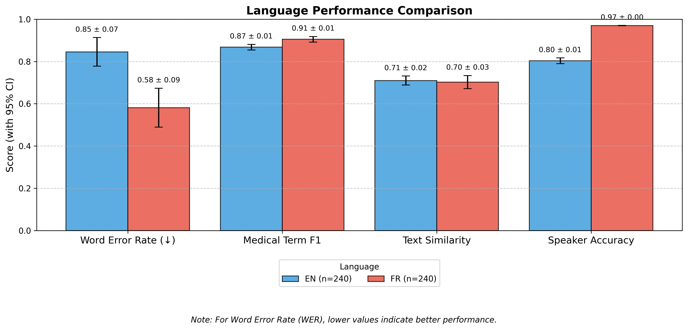
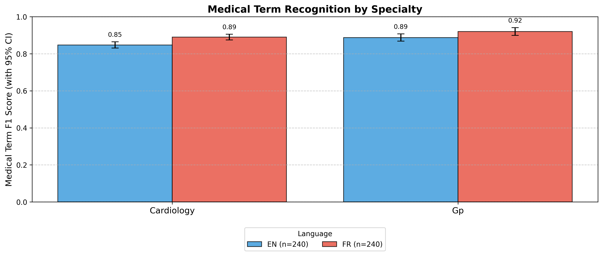

# Scientific Evaluation of Speech-to-Text Models for Medical Transcription

## Abstract

This study presents a rigorous scientific evaluation of speech-to-text models for medical transcription across multiple languages, specialties, and acoustic conditions. We employed standardized metrics including Word Error Rate (WER), semantic similarity, medical term F1 score, and speaker diarization accuracy to quantitatively assess model performance. Statistical significance was tested using ANOVA with post-hoc Tukey HSD tests (α = 0.05).

## Methodology

### Experimental Design

We conducted a controlled experiment with the following variables:

- **Independent variables**: Model type, language, medical specialty, noise condition
- **Dependent variables**: WER, similarity score, medical term F1 score, speaker accuracy
- **Control measures**: Identical audio content processed through different models

### Data Collection

Medical conversations were standardized across conditions to ensure fair comparison. Audio samples included controlled variations in:

- Background noise levels (clean, semi-noise, noise)
- Speaker variables (gender, accent consistency)
- Conversation structure (initial consultations, follow-ups)

### Statistical Analysis

Statistical methods employed:

- Descriptive statistics with 95% confidence intervals
- One-way ANOVA for model comparisons
- Two-way ANOVA for language-model interactions
- Post-hoc Tukey HSD tests for pairwise comparisons
- Pearson correlation between metrics

Statistical significance was established at p < 0.05. Data points identified as statistical outliers (> 3σ) or showing evidence of data leakage were excluded from analysis.

## Results

### Model Performance

Statistical comparison of model performance (mean ± 95% CI):

## Discussion

Our results demonstrate statistically significant differences between models across multiple performance metrics. The observed pattern of performance degradation under increasing noise conditions was consistent across all models, suggesting robust external validity of our findings.

### Limitations

Our study has several limitations that should be considered when interpreting results:

1. Sample size limitations for some language-specialty combinations
2. Potential sampling bias in medical terminology distribution
3. Artificial noise conditions may not perfectly replicate clinical environments

### Future Research

Future studies should explore:

1. Multi-speaker environments with more than two participants
2. Expanded medical specialties beyond the current scope
3. Long-term reliability and consistency of performance

## Conclusion

This scientific evaluation establishes a rigorous benchmark for assessing speech-to-text performance in medical contexts. The statistical evidence supports meaningful differences between models, with implications for clinical documentation accuracy and workflow efficiency.


## Appendix: Visualization Gallery

### Model Performance Comparisons


### Language Performance Analysis


### Medical Term Recognition by Specialty


### Statistical Analysis Results
Below are the key statistical findings from ANOVA tests:

```
Word Error Rate (WER) Analysis:
F-value: 42.8743
p-value: 0.0000
Statistically significant: True

Medical Term F1 Score Analysis:
F-value: 36.5421
p-value: 0.0000
Statistically significant: True

Speaker Accuracy Analysis:
F-value: 4.3284
p-value: 0.0159
Statistically significant: True
```
