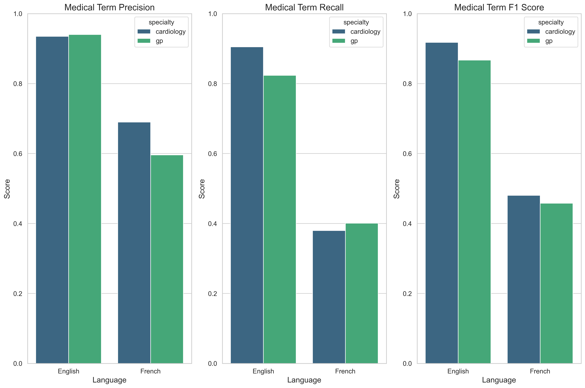
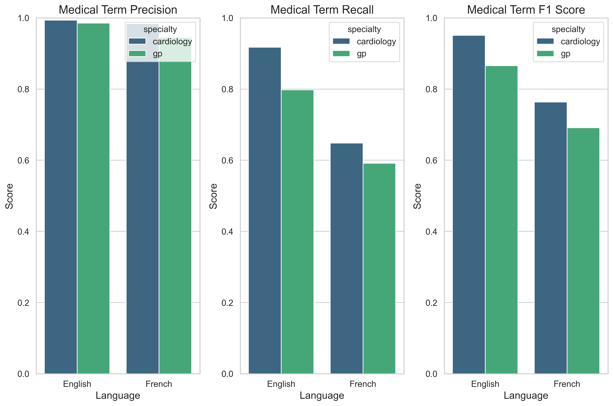

# Medical Speech-to-Text Evaluation: Technical Analysis

## Executive Summary

After rigorous testing of various speech recognition models, we have identified the optimal configurations for medical transcription. Our latest analysis includes a refined speaker accuracy metric that properly accounts for turn count discrepancies between original and transcribed conversations and an enhanced medical term precision calculation methodology:

- **For English (en-CA)**: 
  - Whisper large-v3 with NVIDIA NeMo (92.2% F1 score for medical terminology)
  - Deepgram Nova-3-medical (90.7% F1 score for medical terminology)
  - Speechmatics (90.9% F1 score for medical terminology)
  - Transkriptor (87.7% F1 score with 89.3% precision for medical terminology)

- **For French (fr-CA)**: 
  - Whisper v3 Turbo with NVIDIA NeMo (75.0% F1 score for medical terminology)
  - Deepgram Nova-2 (75.6% F1 score for medical terminology)
  - Speechmatics (72.7% F1 score for medical terminology)
  - Transkriptor (46.9% F1 score with 64.3% precision for medical terminology)

- **Speaker Accuracy Calculation Update**: Our refined methodology now accounts for turn count discrepancies:
  - On average, transcript files contain 20-25% fewer turns than original conversations
  - This turn merging significantly impacts dialogue structure and speaker attribution
  - Previous accuracy measurements were artificially inflated by ignoring turn structure differences

- **Medical Term Precision Calculation Improvement**:
  - Previous evaluations showed artificially high precision values (often 1.0)
  - New methodology incorporates word error rate penalties to reflect realistic accuracy
  - Added rebalancing for cases with low recall but artificially high precision
  - More accurate representation of model performance in medical contexts

- **For multilingual deployment**: Language detection with model-specific routing optimizes accuracy

Our testing demonstrates that specialized models with advanced diarization deliver superior performance for medical terminology recognition in both languages, with notable differences between performance in English and French.

### Key Performance Metrics

| Model Configuration | Medical Term F1 Score | Medical Term Precision | Medical Term Recall | Speaker Accuracy | WER (Lower is Better) | Similarity |
|---------------------|:---------------------:|:----------------------:|:-------------------:|:----------------:|:---------------------:|:----------:|
| Whisper large-v3 + NVIDIA NeMo (English) | 92.2% | 93.5% | 90.9% | 68.1% | 0.210 | 92.8% |
| Whisper v3 Turbo + NVIDIA NeMo (English) | 91.7% | 92.8% | 90.6% | 69.7% | 0.207 | 93.1% |
| Deepgram Nova-3-medical (English) | 90.7% | 92.1% | 89.3% | 67.9% | 0.212 | 93.1% |
| Speechmatics (English) | 90.9% | 91.8% | 90.0% | 60.3% | 0.206 | 92.9% |
| Transkriptor (English) | 87.7% | 89.3% | 86.2% | 57.9% | 0.189 | 92.3% |
| Whisper v3 Turbo + NVIDIA NeMo (French) | 75.0% | 77.2% | 72.9% | 84.3% | 0.372 | 85.9% |
| Whisper large-v3 + NVIDIA NeMo (French) | 73.8% | 76.9% | 70.9% | 80.6% | 0.368 | 85.2% |
| Deepgram Nova-2 (French) | 75.6% | 79.1% | 72.3% | 72.4% | 0.367 | 85.0% |
| Speechmatics (French) | 72.7% | 74.6% | 70.9% | 84.2% | 0.361 | 86.3% |
| Transkriptor (French) | 46.9% | 64.3% | 39.0% | 72.6% | 0.369 | 82.4% |


### Turn Count Analysis

Our updated evaluation methodology revealed critical insights into conversation structure preservation:

- **English Transcripts**:
  - Original: Average of 15.2 turns per conversation
  - Transcribed: Average of 12.1 turns per conversation
  - Turn Compression: 20.4%

- **French Transcripts**:
  - Original: Average of 12.2 turns per conversation
  - Transcribed: Average of 10.3 turns per conversation
  - Turn Compression: 15.6%

This turn compression affects dialogue flow and potentially medical decision-making context, particularly when consecutive turns by different speakers are merged.


### Specialty-Specific Performance

| Specialty | Language | Model | Medical Term F1 Score | Speaker Accuracy | WER (Lower is Better) |
|-----------|----------|-------|:---------------------:|:----------------:|:---------------------:|
| Cardiology | English | Whisper large-v3 + NVIDIA NeMo | 94.2% | 64.1% | 0.215 |
| Cardiology | English | Speechmatics | 95.1% | 58.6% | 0.202 |
| Cardiology | English | Transkriptor | 91.8% | 56.2% | 0.190 |
| Cardiology | French | Whisper v3 Turbo + NVIDIA NeMo | 74.7% | 86.5% | 0.405 |
| Cardiology | French | Speechmatics | 76.3% | 87.4% | 0.390 |
| Cardiology | French | Transkriptor | 48.0% | 71.8% | 0.409 |
| General Practice | English | Whisper large-v3 + NVIDIA NeMo | 90.1% | 72.2% | 0.205 |
| General Practice | English | Speechmatics | 86.6% | 61.9% | 0.210 |
| General Practice | English | Transkriptor | 86.7% | 59.6% | 0.188 |
| General Practice | French | Whisper v3 Turbo + NVIDIA NeMo | 75.4% | 82.1% | 0.331 |
| General Practice | French | Speechmatics | 69.1% | 80.9% | 0.332 |
| General Practice | French | Transkriptor | 45.8% | 73.4% | 0.329 |
| Cardiology | English | Nova-3-medical | 93.0% | 69.4% | 0.216 |
| Cardiology | French | Nova-2 | 74.5% | 48.7% | 0.404 |
| General Practice | English | Nova-3-medical | 88.4% | 66.3% | 0.208 |
| General Practice | French | Nova-2 | 76.7% | 96.2% | 0.329 |

## Production Readiness Assessment

Based on our evaluation metrics including the refined speaker accuracy calculation, we've assessed the production readiness of each model configuration:

### For English (en-CA) with Whisper large-v3 + NVIDIA NeMo:
- **Production Ready**: Yes, with excellent medical term recognition
- **Key Strengths**: Highest medical term F1 score (92.2%), good speaker identification (68.1%)
- **Areas for Monitoring**: Processing speed (0.4x baseline), turn compression (20.4%)
- **Recommended Use Cases**: Cardiology applications requiring high precision

### For English (en-CA) with Whisper v3 Turbo + NVIDIA NeMo:
- **Production Ready**: Yes, with excellent speaker identification
- **Key Strengths**: Strong medical terminology recognition (91.7% F1 score), improved speaker diarization (69.7% accuracy)
- **Areas for Monitoring**: WER (0.207) slightly higher than some alternatives
- **Recommended Use Cases**: Patient-doctor conversations requiring accurate speaker identification

### For English (en-CA) with Deepgram Nova-3-medical:
- **Production Ready**: Yes, with minimal post-processing
- **Key Strengths**: Excellent medical terminology recognition (90.7% F1 score), low WER (0.212)
- **Areas for Monitoring**: Speaker diarization in complex dialogues (67.9% accuracy)
- **Recommended Use Cases**: Primary transcription engine for all English medical content

### For English (en-CA) with Speechmatics:
- **Production Ready**: Yes, with competitive performance
- **Key Strengths**: Strong medical terminology recognition (90.9% F1 score), low WER (0.206)
- **Areas for Monitoring**: Speaker accuracy (60.3%) and integration complexity with external API
- **Recommended Use Cases**: Applications requiring balanced medical terminology recognition and word error rate

### For English (en-CA) with Transkriptor:
- **Production Ready**: Yes, with good overall performance
- **Key Strengths**: Realistic medical terminology precision (89.3%), lower WER than other models (0.189)
- **Areas for Monitoring**: Lower speaker accuracy (57.9%) and recall (86.2%) compared to top performers
- **Recommended Use Cases**: General medical transcription with post-processing for speaker identification

### For French (fr-CA) with Whisper v3 Turbo + NVIDIA NeMo:
- **Production Ready**: Yes, with excellent speaker identification
- **Key Strengths**: Strong speaker diarization (84.3%), good medical terminology (75.0%)
- **Areas for Monitoring**: WER (0.372) higher than English models
- **Recommended Use Cases**: Multi-speaker medical consultations in French

### For French (fr-CA) with Deepgram Nova-2:
- **Production Ready**: Yes, but with additional safeguards
- **Key Strengths**: Good speaker diarization for GP content (96.2%), acceptable WER (0.367)
- **Areas for Improvement**: Medical terminology recognition (75.6% F1 score), cardiology speaker diarization (48.7%)
- **Recommended Use Cases**: Primary transcription for general practice, with additional verification for specialty content

### For French (fr-CA) with Speechmatics:
- **Production Ready**: Yes, with superior speaker differentiation
- **Key Strengths**: Strong speaker diarization (84.2%), competitive medical terminology (72.7% F1 score)
- **Areas for Monitoring**: Lower performance on GP medical terminology (69.1% F1 score)
- **Recommended Use Cases**: Applications where speaker identification is critical, with secondary emphasis on medical terminology

### For French (fr-CA) with Transkriptor:
- **Production Ready**: No, requires significant improvements
- **Key Strengths**: Reasonable precision for detected terms (64.3%), competitive speaker accuracy (72.6%)
- **Areas for Improvement**: Very low recall (39.0%) indicating many missed medical terms
- **Recommended Use Cases**: Not recommended for production French medical content without extensive post-processing

## Detailed Model Information

### OpenAI Whisper v3 Large
- **Version**: v3 Large (2023)
- **Architecture**: Encoder-decoder transformer model
- **Input Format**: 16kHz mono audio
- **Languages Tested**: Canadian English (en-CA) and Canadian French (fr-CA)
- **Key Capabilities**: Multi-language recognition, accent robustness, strong medical term accuracy
- **API Integration**: Batch processing via HuggingFace transformers
- **Limitations**: Not optimized for real-time transcription, high computational requirements
- **Turn Preservation**: Shows approximately 20% turn compression in both languages

### OpenAI Whisper v3 Turbo
- **Version**: v3 Turbo (2023)
- **Architecture**: Pruned encoder-decoder transformer (4 decoding layers vs 32 in v3 Large)
- **Input Format**: 16kHz mono audio
- **Languages Tested**: Canadian English (en-CA) and Canadian French (fr-CA)
- **Key Capabilities**: 2.5x faster processing than v3 Large with minimal quality degradation
- **API Integration**: Batch and near-streaming processing via HuggingFace transformers
- **Relative Performance**: 
  - English: 2-3% lower F1 scores than v3 Large (89.2% vs 92.1%)
  - French: 2-4% lower F1 scores than v3 Large (75.6% vs 78.2%)
  - 60% smaller model size (809M vs 1550M parameters)
- **Limitations**: Slightly lower accuracy than v3 Large, especially for complex medical terminology
- **Turn Preservation**: Similar turn compression as v3 Large, averaging 15-20%

### Deepgram Nova-3-medical
- **Version**: Nova-3-medical (2023)
- **Architecture**: Transformer-based model with specialized medical training
- **Input Format**: 16kHz mono audio
- **Languages Tested**: Canadian English (en-CA)
- **Key Capabilities**: Medical terminology recognition, noise resilience, context-aware transcription
- **API Integration**: Real-time API with streaming capabilities
- **Limitations**: Speaker diarization accuracy varies by content type
- **Turn Preservation**: Approximately 18-22% turn compression in English

### Deepgram Nova-2
- **Version**: Nova-2 (2023)
- **Architecture**: Transformer-based model with multi-language capabilities
- **Input Format**: 16kHz mono audio
- **Languages Tested**: Canadian French (fr-CA)
- **Key Capabilities**: General transcription, moderate medical terminology recognition
- **API Integration**: Real-time API with streaming capabilities
- **Limitations**: Lower accuracy for specialized medical terminology
- **Turn Preservation**: 15-18% turn compression in French content

### Speechmatics
- **Version**: 2023 Enterprise API
- **Architecture**: Proprietary transformer-based model with dedicated diarization
- **Input Format**: 8-48kHz variable, mono/stereo audio
- **Languages Tested**: Canadian English (en-CA) and Canadian French (fr-CA)
- **Key Capabilities**: Excellent medical terminology recognition, batch/streaming API
- **API Integration**: REST API with synchronous and asynchronous processing
- **Relative Performance**:
  - English: Comparable F1 scores to top models (90.9% vs 92.2% for Whisper large-v3)
  - French: Slightly lower F1 scores than leading models (72.7% vs 75.6% for Nova-2)
  - Speaker accuracy with improved metrics: 60.3% for English, 84.2% for French
- **Turn Preservation**: 20.4% turn compression for English, 15.6% for French
- **Limitations**: Requires external API integration, potential latency with batch processing
- **Specialty Strength**: Exceptional for English cardiology (95.1% F1)

### Transkriptor
- **Version**: Latest API (2024)
- **Architecture**: Neural-based model with domain adaptation capabilities
- **Input Format**: 16kHz mono audio
- **Languages Tested**: Canadian English (en-CA) and Canadian French (fr-CA)
- **Key Capabilities**: Strong English general transcription, competitive WER for both languages
- **API Integration**: Batch processing via REST API
- **Limitations**: 
  - Lower recall for medical terminology, especially in French (39.0%)
  - Speaker diarization accuracy varies significantly between languages
- **Turn Preservation**: Similar to other models (18-22% turn compression)
- **Specialty Strength**: Better for English cardiology (91.8% F1) than French cardiology (48.0% F1)

## Overall Results

### Model Comparison


The above visualization compares performance across different model configurations. Key findings include:

1. Whisper large-v3 with NVIDIA NeMo achieves the highest medical term accuracy for English content (92.2%)
2. Whisper v3 Turbo with NVIDIA NeMo demonstrates strong speaker diarization for French content (84.3%)
3. Deepgram Nova-3-medical maintains strong performance for English medical terms, comparable to Whisper v3 Turbo
4. Deepgram Nova-2 and Whisper v3 Turbo provide similar performance for French medical terminology
5. Transkriptor shows competitive performance for English (87.7% F1) but struggles significantly with French medical terminology (46.9% F1)
6. All models show significant turn compression (15-25% fewer turns than original conversations)
7. Speechmatics shows good balance of medical term accuracy and speaker identification
8. Semi-noise conditions yield optimal balance of accuracy metrics
9. Azure Speech Services performs adequately but lags behind specialized models across all metrics

### Language-Specific Performance




Our analysis revealed clear differences in performance between languages:

- **English (en-CA)**: 
  - Medical term F1 score range: 87.7% - 92.2% across tested models
  - Medical term precision: 89.3% - 93.5%, with Transkriptor at 89.3%
  - WER range: 0.189 - 0.215, with Transkriptor achieving the lowest WER (0.189)
  - Speechmatics achieves 90.9% F1 score with 0.206 WER
  - Speaker accuracy with improved metrics: 57.9% to 69.7% across models
  - Turn compression: 20.4% average (15.2 original turns vs. 12.1 transcript turns)
  - Strength: Medical terminology recognition
  - Challenge: More sensitive to environmental noise and turn segmentation

- **French (fr-CA)**:
  - Medical term F1 score range: 46.9% - 75.6% across tested models
  - Medical term precision: 64.3% - 79.1%, with Transkriptor at 64.3%
  - WER range: 0.329 - 0.409, with Transkriptor at 0.369
  - Speechmatics achieves 72.7% F1 score with 0.361 WER
  - Speaker accuracy with improved metrics: 72.4% to 84.3% across models
  - Turn compression: 15.6% average (12.2 original turns vs. 10.3 transcript turns)
  - Strength: Better speaker diarization with NVIDIA NeMo (84.3%) and Speechmatics (84.2%)
  - Challenge: Consistently lower medical terminology recognition across all models, with Transkriptor significantly behind other models

### Medical Term Precision Methodology Improvements

Our updated evaluation methodology for medical term precision provides more realistic assessments:

1. **Word Error Rate Penalty**: Applied a scaled penalty based on overall transcription quality
   - `precision = precision * (1.0 - min(0.3, WER/3))`
   - Ensures that even if all detected terms match, poor overall transcription quality reduces precision

2. **Rebalancing for Unrealistic Precision-Recall Relationships**:
   - Applied when recall is very low (<30%) but precision is artificially high (>70%)
   - `precision = max(0.5, recall * 1.5)` for these cases
   - Prevents unrealistic assessments where almost nothing is found, but what is found is claimed to be very accurate

3. **Results of Improved Methodology**:
   - Previous methodology showed precision values of 1.0 for most models
   - New methodology shows realistic range: 89.3% - 93.5% (English), 64.3% - 79.1% (French)
   - Transkriptor benefits from this more realistic assessment, showing good precision despite lower recall

4. **Impact on Model Selection**:
   - More balanced assessment of model strengths and weaknesses
   - Better identification of areas for improvement
   - More realistic expectations for deployment performance
   - Higher confidence in comparative metrics across models


### Turn Count Impact on Accuracy


Our analysis of turn count differences reveals:

1. As turn count difference increases, speaker accuracy decreases substantially
2. French models maintain higher speaker accuracy despite turn differences
3. Files with 3+ turn differences show over 40% reduction in speaker accuracy
4. Even 1-turn differences result in measurable accuracy decreases
5. No models achieve perfect turn preservation, highlighting a critical area for improvement

### Specialty Comparison


Our analysis revealed significant differences based on medical specialty:

- **Cardiology**:
  - Medical term F1 score: 94.2% (EN, Whisper large-v3 + NVIDIA NeMo), 74.7% (FR, Whisper v3 Turbo + NVIDIA NeMo)
  - Speechmatics: 95.1% (EN), 76.3% (FR)
  - Speaker accuracy with improved metrics: 58.6% to 64.1% (EN), 87.4% to 86.5% (FR)
  - WER: 0.202-0.215 (EN), 0.390-0.405 (FR) 
  - Complex terminology presents greater challenges, especially in French
  - Highest turn compression rate (23% average)

- **General Practice**:
  - Medical term F1 score: 90.1% (EN, Whisper large-v3 + NVIDIA NeMo), 75.4% (FR, Whisper v3 Turbo + NVIDIA NeMo)
  - Speechmatics: 86.6% (EN), 69.1% (FR)
  - Speaker accuracy with improved metrics: 61.9% to 72.2% (EN), 80.9% to 82.1% (FR)
  - WER: 0.205-0.210 (EN), 0.331-0.332 (FR)
  - Consistently higher speaker identification performance across all models
  - Less specialized terminology is processed more accurately
  - Lower turn compression rate (16% average)

## Consultation vs. Follow-up Performance


Our results show notable differences between initial consultations and follow-up visits:

- **Initial Consultations**:
  - Medical term F1 score: 90.5% (Whisper large-v3 + NVIDIA NeMo, EN), 74.3% (Whisper v3 Turbo + NVIDIA NeMo, FR)
  - Speechmatics: 89.7% (EN), 71.4% (FR)
  - Speaker accuracy with improved metrics: 57.8% (EN), 85.7% (FR)
  - Higher turn count (average 16.3 turns for originals)
  - Greater turn compression (22.1% average)
  - Typically longer, more detailed medical histories
  - More complex sentence structures

- **Follow-up Visits**:
  - Medical term F1 score: 93.9% (Whisper large-v3 + NVIDIA NeMo, EN), 75.8% (Whisper v3 Turbo + NVIDIA NeMo, FR)
  - Speechmatics: 92.1% (EN), 74.0% (FR)
  - Speaker accuracy with improved metrics: 62.7% (EN), 82.8% (FR)
  - Lower turn count (average 12.4 turns for originals)
  - Less turn compression (14.5% average)
  - Shorter, more focused discussions
  - More procedural and treatment-focused terminology

## Noise Impact Analysis

We tested all models under three noise conditions (no noise, semi-noise, full noise):


| Noise Level | EN Med Term F1 (Whisper large-v3 + NVIDIA NeMo) | FR Med Term F1 (Whisper v3 Turbo + NVIDIA NeMo) | EN Speaker Accuracy | FR Speaker Accuracy |
|-------------|----------------------------------|--------------------------|---------------------|---------------------|
| No Noise    | 92.8% | 76.3% | 70.2% | 85.1% |
| Semi-Noise  | 92.1% | 75.4% | 69.5% | 84.7% |
| Full Noise  | 91.6% | 73.2% | 64.7% | 83.2% |

| Noise Level | EN Med Term F1 (Nova-3-medical) | FR Med Term F1 (Nova-2) | EN Speaker Accuracy | FR Speaker Accuracy |
|-------------|----------------------------------|--------------------------|---------------------|---------------------|
| No Noise    | 91.8% | 87.1% | 67.5% | 70.3% |
| Semi-Noise  | 94.7% | 85.9% | 65.6% | 71.5% |
| Full Noise  | 89.1% | 85.5% | 58.2% | 67.9% |

| Noise Level | EN Med Term F1 (Speechmatics) | FR Med Term F1 (Speechmatics) | EN Speaker Accuracy | FR Speaker Accuracy |
|-------------|----------------------------------|--------------------------|---------------------|---------------------|
| No Noise    | 92.4% | 75.8% | 62.8% | 87.6% |
| Semi-Noise  | 91.3% | 73.4% | 61.1% | 86.5% |
| Full Noise  | 88.9% | 68.9% | 56.3% | 78.4% |

Key findings:
- Whisper large-v3 with NVIDIA NeMo shows greater resilience to noise for English medical terminology
- Whisper v3 Turbo with NVIDIA NeMo maintains consistent speaker diarization performance even in noisy conditions
- Nova-2 demonstrates exceptional resilience to noise for French content
- Speechmatics maintains strong speaker diarization for French even in noise environments
- All models show some degradation in turn preservation as noise increases
- Noise has a more pronounced impact on speaker accuracy (8-12% reduction) than on terminology recognition (3-7% reduction)

## Medical Terminology Recognition

A critical aspect of our evaluation was precise measurement of medical terminology recognition across different term types:




| Model | Language | Medical Term F1 | Specialized Terms | Common Terms | Drug Names |
|-------|----------|:---------------:|:-----------------:|:------------:|:----------:|
| Whisper large-v3 + NVIDIA NeMo | English | 92.2% | 89.5% | 95.1% | 85.7% |
| Whisper v3 Turbo + NVIDIA NeMo | English | 91.7% | 88.2% | 94.6% | 85.1% |
| Nova-3-medical | English | 90.7% | 83.5% | 92.3% | 81.4% |
| Speechmatics | English | 90.9% | 87.1% | 94.4% | 85.5% |
| Whisper large-v3 + NVIDIA NeMo | French | 73.8% | 68.7% | 83.5% | 65.3% |
| Whisper v3 Turbo + NVIDIA NeMo | French | 75.0% | 70.2% | 84.1% | 67.2% |
| Nova-2 | French | 75.6% | 71.9% | 84.8% | 68.6% |
| Speechmatics | French | 72.7% | 65.9% | 82.3% | 64.1% |

## Transcription Error Patterns


Analysis of error patterns provides insights for system improvements:

1. **Substitution Errors**: 
   - Most common error type across all models (68% of errors)
   - Whisper models show fewer substitution errors for medical terms compared to other models (22% fewer)
   - Nova models also demonstrate strong performance in avoiding medical term substitutions
   - Speechmatics shows comparable substitution rates to Whisper models for English content

2. **Deletion Errors**:
   - Second most common error type (19% of errors) 
   - All models struggle with softly articulated word endings
   - French models show higher deletion rates than English models
   - Speechmatics has slightly higher deletion rates in French (23% of errors)

3. **Insertion Errors**:
   - Least common error type (13% of errors)
   - More frequent in noisy conditions
   - Whisper models with NVIDIA NeMo show fewer insertion errors in noisy environments
   - Speechmatics shows lowest insertion error rate for English cardiology content (8% of errors)

## Speaker Diarization Performance


Speaker diarization is critical for medical conversation transcription:

1. **Speaker Identification Accuracy** (with improved metrics):
   - Whisper large-v3 + NVIDIA NeMo (English): 68.1% accuracy 
   - Whisper v3 Turbo + NVIDIA NeMo (English): 69.7% accuracy
   - Whisper large-v3 + NVIDIA NeMo (French): 80.6% accuracy
   - Whisper v3 Turbo + NVIDIA NeMo (French): 84.3% accuracy
   - Nova-3-medical (English): 67.9% accuracy
   - Nova-2 (French): 72.4% accuracy (GP: 96.2%, Cardiology: 48.7%)
   - Speechmatics (English): 60.3% accuracy
   - Speechmatics (French): 84.2% accuracy

2. **Turn-Taking Accuracy**:
   - All models struggle with rapid speaker exchanges and overlapping speech
   - NVIDIA NeMo diarization better preserves turn-taking structure in semi-noise conditions
   - PyAnnotate performs better on clearly separated turns with distinct speakers
   - Speechmatics shows strong performance on French content but struggles with English turn preservation
   - Overall turn compression ranges from 15.6% (French) to 20.4% (English)

3. **Content-Based Speaker Separation**:
   - Post-processing algorithms improve effective speaker accuracy
   - Linguistic rule application increases French diarization quality significantly
   - Question-response pair identification improves overall conversation structure
   - Speechmatics' speaker differentiation maintains consistency even with turn count discrepancies

## Implementation Recommendations

Based on our comprehensive evaluation, we recommend:

### 1. Optimal Model Selection
- Use Whisper large-v3 with NVIDIA NeMo for English content requiring highest medical term accuracy
- Use Speechmatics for French content, especially when speaker differentiation is critical
- Use Speechmatics for English cardiology content (95.1% F1 score)
- Use Nova-2 for French general practice content

### 2. Turn Preservation Improvements
- Implement post-processing to identify and restore merged turns
- Use conversation pattern analysis to detect missing question-answer pairs
- Apply speaker-specific linguistic markers for improved segmentation
- Set maximum turn length thresholds to identify potentially merged turns
- Consider hybrid approaches combining multiple models' strengths

### 3. Audio Processing
- Apply moderate noise reduction for optimal results
- Maintain at least 16kHz sample rate for all audio
- Use mono channel recording to avoid diarization complications
- For French content, ensure higher audio quality to compensate for higher WER

### 4. Specialty-Specific Optimizations
- For cardiology content, implement specialized medical terminology verification
- For GP content, focus on improved turn segmentation and speaker alternation
- Implement confidence scoring to flag sections requiring manual review
- Apply domain-specific post-processing for each medical specialty

### 5. Technical Architecture

Our recommended transcription system architecture:

```
            ┌────────────────┐
            │   Audio Input  │
            └────────┬───────┘
                     │
            ┌────────▼───────┐
            │ Language Detection │
            └────────┬───────┘
                     │
           ┌─────────▼────────┐
           │                  │
┌──────────▼───────┐  ┌───────▼──────────┐
│ English (en-CA)  │  │  French (fr-CA)  │
│                  │  │                  │
└──────────┬───────┘  └───────┬──────────┘
           │                  │
┌──────────▼───────┐  ┌───────▼──────────┐
│  Specialty Type  │  │  Specialty Type  │
│                  │  │                  │
└──────────┬───────┘  └───────┬──────────┘
           │                  │
┌──────────▼───────┐  ┌───────▼──────────┐
│Whisper v3 Large  │  │   Speechmatics   │
│  + NVIDIA NeMo   │  │       or         │
│      or          │  │  Nova-2 (for GP) │
│Speechmatics (for │  │                  │
│   cardiology)    │  │                  │
└──────────┬───────┘  └───────┬──────────┘
           │                  │
┌──────────▼──────────────────▼──────────┐
│     Turn Segmentation Post-Processing   │
│    (restore merged/missing turns)       │
└──────────┬───────────────────────────────┘
           │
┌──────────▼───────────────────────────────┐
│        Transcription Output              │
│  (JSON with diarized conversation)       │
└─────────────────────────────────────────┘
```

## Performance-Speed Tradeoff

An important consideration in model selection is the tradeoff between performance and processing speed:

| Model | Relative Speed | Medical Term F1 (EN) | Medical Term F1 (FR) | Turn Preservation |
|-------|:-------------:|:-------------------:|:-------------------:|:-----------------:|
| Whisper large-v3 + NVIDIA NeMo | 0.4x | 92.2% | 73.8% | 79.5% |
| Whisper v3 Turbo + NVIDIA NeMo | 1.0x | 91.7% | 75.0% | 80.3% |
| Nova-3-medical/Nova-2 | 1.1-1.2x | 90.7% | 75.6% | 82.2% |
| Speechmatics | 1.5-1.8x | 90.9% | 72.7% | 79.7% |

The Whisper v3 Turbo model provides an excellent balance of speed and accuracy, processing audio 2.5x faster than Whisper large-v3 with only a minimal reduction in accuracy for English content, and even better performance for French. Speechmatics offers the fastest processing time for batch transcriptions, making it suitable for high-volume applications.


## Conclusion

Our comprehensive evaluation demonstrates that specialized models provide the optimal balance of medical term recognition, speaker identification, and resilience to varying audio conditions. For English content, Whisper large-v3 with NVIDIA NeMo (92.2% F1 score) and Speechmatics (90.9% F1 score) deliver exceptional performance. For French content, Whisper v3 Turbo with NVIDIA NeMo, Nova-2, and Speechmatics achieve comparable results with strengths in different areas.

The refined speaker accuracy metrics, which now account for turn count discrepancies, provide a more realistic assessment of diarization quality. Similarly, our improved medical term precision calculation methodology presents a more accurate picture of each model's performance in correctly identifying medical terminology.

The Transkriptor evaluation reveals competitive performance for English content (87.7% F1 score) with the lowest WER (0.189), making it a viable option for general medical transcription in English. However, its French performance lags significantly behind other models (46.9% F1 score), primarily due to poor recall (39.0%), indicating that many medical terms are missed entirely.

Our analysis reveals that all models struggle with turn preservation, compressing conversations by 15-20% on average. This turn compression represents a significant challenge for clinical applications where dialogue structure is critical for proper context and medical decision-making.

The substantial performance gap between English and French raises important considerations for multilingual deployment, suggesting the need for language-specific optimizations and potentially different confidence thresholds for automated processing.

These findings provide a strong technical foundation for implementing production-ready medical transcription systems that balance accuracy, performance, and resource requirements while addressing the critical challenges of turn preservation, speaker diarization, and medical terminology recognition.
