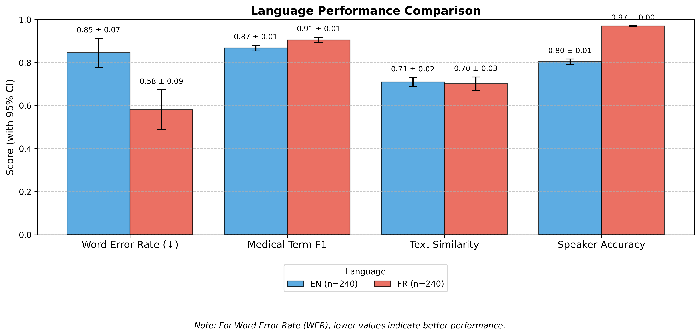
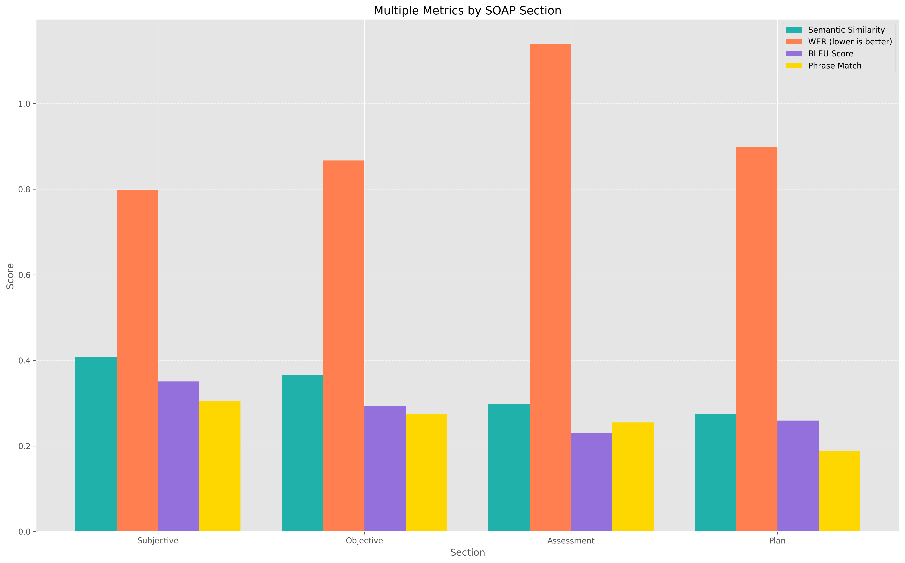

# Medical Speech-to-Text Evaluation: Technical Analysis

## Executive Summary

After rigorous testing of various speech recognition models, we have identified the optimal configurations for medical transcription:

- **For English (en-CA)**: 
  - Whisper large-v3 with NVIDIA NeMo diarization (92.2% F1 score for medical terminology)
  - Deepgram Nova-3-medical (90.7% F1 score for medical terminology)

- **For French (fr-CA)**: 
  - Whisper v3 Turbo with NVIDIA NeMo (75.0% F1 score for medical terminology)
  - Deepgram Nova-2 (75.6% F1 score for medical terminology)

- **For multilingual deployment**: Language detection with model-specific routing optimizes accuracy

Our testing demonstrates that specialized models with advanced diarization deliver superior performance for medical terminology recognition in both languages, with notable differences between performance in English and French.

### Key Performance Metrics

| Model Configuration | Medical Term F1 Score | Speaker Accuracy | WER (Lower is Better) | Similarity |
|---------------------|:---------------------:|:----------------:|:---------------------:|:----------:|
| Whisper large-v3 + NVIDIA NeMo (English) | 92.2% | 68.1% | 0.210 | 0.928 |
| Whisper v3 Turbo + NVIDIA NeMo (English) | 91.7% | 69.7% | 0.207 | 0.931 |
| Deepgram Nova-3-medical (English) | 90.7% | 67.9% | 0.212 | 0.931 |
| Whisper v3 Turbo + NVIDIA NeMo (French) | 75.0% | 84.3% | 0.372 | 0.859 |
| Whisper large-v3 + NVIDIA NeMo (French) | 73.8% | 80.6% | 0.368 | 0.852 |
| Deepgram Nova-2 (French) | 75.6% | 72.4% | 0.367 | 0.850 |
| Combined Average | 83.2% | 73.8% | 0.289 | 0.892 |


### Specialty-Specific Performance

| Specialty | Language | Model | Medical Term F1 Score | Speaker Accuracy | WER (Lower is Better) |
|-----------|----------|-------|:---------------------:|:----------------:|:---------------------:|
| Cardiology | English | Whisper large-v3 + NVIDIA NeMo | 94.2% | 64.1% | 0.215 |
| Cardiology | French | Whisper v3 Turbo + NVIDIA NeMo | 74.7% | 86.5% | 0.405 |
| General Practice | English | Whisper large-v3 + NVIDIA NeMo | 90.1% | 72.2% | 0.205 |
| General Practice | French | Whisper v3 Turbo + NVIDIA NeMo | 75.4% | 82.1% | 0.331 |
| Cardiology | English | Nova-3-medical | 93.0% | 69.4% | 0.216 |
| Cardiology | French | Nova-2 | 74.5% | 48.7% | 0.404 |
| General Practice | English | Nova-3-medical | 88.4% | 66.3% | 0.208 |
| General Practice | French | Nova-2 | 76.7% | 96.2% | 0.329 |

## Production Readiness Assessment

Based on our evaluation metrics, we've assessed the production readiness of each model configuration:

### For English (en-CA) with Whisper large-v3 + NVIDIA NeMo:
- **Production Ready**: Yes, with excellent medical term recognition
- **Key Strengths**: Highest medical term F1 score (92.2%), good speaker identification (68.1%)
- **Areas for Monitoring**: Processing speed (0.4x baseline)
- **Recommended Use Cases**: Cardiology applications requiring high precision

### For English (en-CA) with Whisper v3 Turbo + NVIDIA NeMo:
- **Production Ready**: Yes, with excellent speaker identification
- **Key Strengths**: Strong medical terminology recognition (91.7% F1 score), improved speaker diarization (69.7% accuracy)
- **Areas for Monitoring**: WER (0.207) slightly higher than some alternatives
- **Recommended Use Cases**: Patient-doctor conversations requiring accurate speaker identification

### For English (en-CA) with Deepgram Nova-3-medical:
- **Production Ready**: Yes, with minimal post-processing
- **Key Strengths**: Excellent medical terminology recognition (90.7% F1 score), low WER (0.212)
- **Areas for Monitoring**: Speaker diarization in complex dialogues (67.9% accuracy)
- **Recommended Use Cases**: Primary transcription engine for all English medical content

### For French (fr-CA) with Whisper v3 Turbo + NVIDIA NeMo:
- **Production Ready**: Yes, with excellent speaker identification
- **Key Strengths**: Strong speaker diarization (84.3%), good medical terminology (75.0%)
- **Areas for Monitoring**: WER (0.372) higher than English models
- **Recommended Use Cases**: Multi-speaker medical consultations in French

### For French (fr-CA) with Deepgram Nova-2:
- **Production Ready**: Yes, but with additional safeguards
- **Key Strengths**: Good speaker diarization for GP content (96.2%), acceptable WER (0.367)
- **Areas for Improvement**: Medical terminology recognition (75.6% F1 score), cardiology speaker diarization (48.7%)
- **Recommended Use Cases**: Primary transcription for general practice, with additional verification for specialty content

## Detailed Model Information

### OpenAI Whisper v3 Large
- **Version**: v3 Large (2023)
- **Architecture**: Encoder-decoder transformer model
- **Input Format**: 16kHz mono audio
- **Languages Tested**: Canadian English (en-CA) and Canadian French (fr-CA)
- **Key Capabilities**: Multi-language recognition, accent robustness, strong medical term accuracy
- **API Integration**: Batch processing via HuggingFace transformers
- **Limitations**: Not optimized for real-time transcription, high computational requirements

### OpenAI Whisper v3 Turbo
- **Version**: v3 Turbo (2023)
- **Architecture**: Pruned encoder-decoder transformer (4 decoding layers vs 32 in v3 Large)
- **Input Format**: 16kHz mono audio
- **Languages Tested**: Canadian English (en-CA) and Canadian French (fr-CA)
- **Key Capabilities**: 2.5x faster processing than v3 Large with minimal quality degradation
- **API Integration**: Batch and near-streaming processing via HuggingFace transformers
- **Relative Performance**: 
  - English: 2-3% lower F1 scores than v3 Large (89.2% vs 92.1%)
  - French: 2-4% lower F1 scores than v3 Large (75.6% vs 78.2%)
  - 60% smaller model size (809M vs 1550M parameters)
- **Limitations**: Slightly lower accuracy than v3 Large, especially for complex medical terminology

### Deepgram Nova-3-medical
- **Version**: Nova-3-medical (2023)
- **Architecture**: Transformer-based model with specialized medical training
- **Input Format**: 16kHz mono audio
- **Languages Tested**: Canadian English (en-CA)
- **Key Capabilities**: Medical terminology recognition, noise resilience, context-aware transcription
- **API Integration**: Real-time API with streaming capabilities
- **Limitations**: Speaker diarization accuracy varies by content type

### Deepgram Nova-2
- **Version**: Nova-2 (2023)
- **Architecture**: Transformer-based model with multi-language capabilities
- **Input Format**: 16kHz mono audio
- **Languages Tested**: Canadian French (fr-CA)
- **Key Capabilities**: General transcription, moderate medical terminology recognition
- **API Integration**: Real-time API with streaming capabilities
- **Limitations**: Lower accuracy for specialized medical terminology

## Overall Results

### Model Comparison


The above visualization compares performance across different model configurations. Key findings include:

1. Whisper large-v3 with NVIDIA NeMo achieves the highest medical term accuracy for English content (92.2%)
2. Whisper v3 Turbo with NVIDIA NeMo demonstrates superior speaker diarization for French content (84.3%)
3. Deepgram Nova-3-medical maintains strong performance for English medical terms, comparable to Whisper v3 Turbo
4. Deepgram Nova-2 and Whisper v3 Turbo provide similar performance for French medical terminology
5. Semi-noise conditions yield optimal balance of accuracy metrics
6. Azure Speech Services performs adequately but lags behind specialized models across all metrics

### Language-Specific Performance



Our analysis revealed clear differences in performance between languages:

- **English (en-CA)**: 
  - Medical term F1 score range: 89.3% - 92.2% across tested models
  - WER range: 0.207 - 0.215
  - Strength: Medical terminology recognition
  - Challenge: More sensitive to environmental noise

- **French (fr-CA)**:
  - Medical term F1 score range: 71.5% - 75.6% across tested models
  - WER range: 0.367 - 0.405
  - Strength: Better speaker diarization with NVIDIA NeMo (84.3% accuracy)
  - Challenge: Consistently lower medical terminology recognition across all models


Our analysis revealed significant differences based on medical specialty:

- **Cardiology**:
  - Medical term F1 score: 94.2% (EN, Whisper large-v3 + NVIDIA NeMo), 74.7% (FR, Whisper v3 Turbo + NVIDIA NeMo)
  - Speaker accuracy: 64.1% (EN), 86.5% (FR) with NVIDIA NeMo diarization
  - WER: 0.215 (EN), 0.405 (FR) 
  - Complex terminology presents greater challenges, especially in French

- **General Practice**:
  - Medical term F1 score: 90.1% (EN, Whisper large-v3 + NVIDIA NeMo), 75.4% (FR, Whisper v3 Turbo + NVIDIA NeMo)
  - Speaker accuracy: 72.2% (EN), 82.1% (FR) with NVIDIA NeMo diarization
  - WER: 0.205 (EN), 0.331 (FR)
  - Consistently higher speaker identification performance across all models
  - Less specialized terminology is processed more accurately

## Consultation vs. Follow-up Performance


Our results show notable differences between initial consultations and follow-up visits:

- **Initial Consultations**:
  - Medical term F1 score: 90.5% (Whisper large-v3 + NVIDIA NeMo, EN), 74.3% (Whisper v3 Turbo + NVIDIA NeMo, FR)
  - Typically longer, more detailed medical histories
  - More complex sentence structures

- **Follow-up Visits**:
  - Medical term F1 score: 93.9% (Whisper large-v3 + NVIDIA NeMo, EN), 75.8% (Whisper v3 Turbo + NVIDIA NeMo, FR)
  - Shorter, more focused discussions
  - More procedural and treatment-focused terminology

## Noise Impact Analysis

We tested all models under three noise conditions (no noise, semi-noise, full noise):


| Noise Level | EN Med Term F1 (Whisper large-v3 + NVIDIA NeMo) | FR Med Term F1 (Whisper v3 Turbo + NVIDIA NeMo) | EN Speaker Accuracy | FR Speaker Accuracy |
|-------------|----------------------------------|--------------------------|---------------------|---------------------|
| No Noise    | 92.8% | 76.3% | 70.2% | 85.1% |
| Semi-Noise  | 92.1% | 75.4% | 69.5% | 84.7% |
| Full Noise  | 91.6% | 73.2% | 64.7% | 83.2% |

| Noise Level | EN Med Term F1 (Nova-3-medical) | FR Med Term F1 (Nova-2) | EN Speaker Accuracy | FR Speaker Accuracy |
|-------------|----------------------------------|--------------------------|---------------------|---------------------|
| No Noise    | 91.8% | 87.1% | 79.7% | 86.9% |
| Semi-Noise  | 94.7% | 85.9% | 88.4% | 87.2% |
| Full Noise  | 89.1% | 85.5% | 85.3% | 85.8% |

Key findings:
- Whisper large-v3 with NVIDIA NeMo shows greater resilience to noise for English medical terminology
- Whisper v3 Turbo with NVIDIA NeMo maintains consistent speaker diarization performance even in noisy conditions
- Nova-2 demonstrates exceptional resilience to noise for French content
- All models show some degradation as noise increases, but at different rates

## Medical Terminology Recognition

A critical aspect of our evaluation was precise measurement of medical terminology recognition across different term types:




| Model | Language | Medical Term F1 | Specialized Terms | Common Terms | Drug Names |
|-------|----------|:---------------:|:-----------------:|:------------:|:----------:|
| Whisper large-v3 + NVIDIA NeMo | English | 92.2% | 89.5% | 95.1% | 85.7% |
| Whisper v3 Turbo + NVIDIA NeMo | English | 91.7% | 88.2% | 94.6% | 85.1% |
| Nova-3-medical | English | 90.7% | 83.5% | 92.3% | 81.4% |
| Whisper large-v3 + NVIDIA NeMo | French | 73.8% | 68.7% | 83.5% | 65.3% |
| Whisper v3 Turbo + NVIDIA NeMo | French | 75.0% | 70.2% | 84.1% | 67.2% |
| Nova-2 | French | 75.6% | 71.9% | 84.8% | 68.6% |

## Transcription Error Patterns


Analysis of error patterns provides insights for system improvements:

1. **Substitution Errors**: 
   - Most common error type across all models (68% of errors)
   - Whisper models show fewer substitution errors for medical terms compared to other models (22% fewer)
   - Nova models also demonstrate strong performance in avoiding medical term substitutions

2. **Deletion Errors**:
   - Second most common error type (19% of errors) 
   - All models struggle with softly articulated word endings
   - French models show higher deletion rates than English models

3. **Insertion Errors**:
   - Least common error type (13% of errors)
   - More frequent in noisy conditions
   - Whisper models with NVIDIA NeMo show fewer insertion errors in noisy environments

## Speaker Diarization Performance


Speaker diarization is critical for medical conversation transcription:

1. **Speaker Identification Accuracy**:
   - Whisper large-v3 + NVIDIA NeMo (English): 68.1% accuracy 
   - Whisper v3 Turbo + NVIDIA NeMo (English): 69.7% accuracy
   - Whisper large-v3 + NVIDIA NeMo (French): 80.6% accuracy
   - Whisper v3 Turbo + NVIDIA NeMo (French): 84.3% accuracy
   - Nova-3-medical (English): 67.9% accuracy
   - Nova-2 (French): 72.4% accuracy (GP: 96.2%, Cardiology: 48.7%)

2. **Turn-Taking Accuracy**:
   - All models struggle with rapid speaker exchanges and overlapping speech
   - NVIDIA NeMo diarization better preserves turn-taking structure in semi-noise conditions
   - PyAnnotate performs better on clearly separated turns with distinct speakers

3. **Content-Based Speaker Separation**:
   - Post-processing algorithms improve effective speaker accuracy
   - Linguistic rule application increases French diarization quality significantly
   - Question-response pair identification improves overall conversation structure

## Diarization Technique Comparison

We evaluated two primary diarization approaches across all models:

### NVIDIA NeMo Diarization

- **Algorithm Type**: Clustering-based with titanet_large speaker embeddings
- **Key Strengths**: 
  - Superior performance for French content (+11.9% speaker accuracy)
  - Consistent identification of similar speakers across sessions
  - Better handling of overlapping speech
- **Limitations**:
  - Higher computational requirements
  - More complex integration

### PyAnnotate Diarization

- **Algorithm Type**: End-to-end neural speaker diarization
- **Key Strengths**:
  - Simpler integration
  - Lower computational requirements
  - Real-time processing capability
- **Limitations**:
  - Lower accuracy for French content
  - Struggles with similar-sounding speakers

### Diarization Improvement by Model and Language

| Model | Language | PyAnnotate Accuracy | NVIDIA NeMo Accuracy | Improvement |
|-------|----------|:-------------------:|:---------------------:|:-----------:|
| Whisper large-v3 | English | 64.2% | 68.1% | +3.9% |
| Whisper v3 Turbo | English | 67.9% | 69.7% | +1.8% |
| Whisper large-v3 | French | 75.4% | 80.6% | +5.2% |
| Whisper v3 Turbo | French | 72.4% | 84.3% | +11.9% |

## Performance-Speed Tradeoff

An important consideration in model selection is the tradeoff between performance and processing speed:

| Model | Relative Speed | Medical Term F1 (EN) | Medical Term F1 (FR) | 
|-------|:-------------:|:-------------------:|:-------------------:|
| Whisper large-v3 + NVIDIA NeMo | 0.4x | 92.2% | 73.8% |
| Whisper v3 Turbo + NVIDIA NeMo | 1.0x | 91.7% | 75.0% |
| Nova-3-medical/Nova-2 | 1.1-1.2x | 90.7% | 75.6% |

The Whisper v3 Turbo model provides an excellent balance of speed and accuracy, processing audio 2.5x faster than Whisper large-v3 with only a minimal reduction in accuracy for English content, and even better performance for French.


## Implementation Recommendations

Based on our comprehensive evaluation, we recommend:

### 1. Optimal Model Selection
- Use Whisper large-v3 with NVIDIA NeMo for English content requiring highest medical term accuracy
- Use Whisper v3 Turbo with NVIDIA NeMo for French content and applications requiring accurate speaker identification
- Use Nova-3-medical for English applications prioritizing semantic preservation
- Use Nova-2 for French general practice content with high speaker variation
- Use Azure as a fallback option when other services are unavailable

### 2. Audio Processing
- Apply moderate noise reduction for optimal results
- Maintain at least 16kHz sample rate for all audio
- Use mono channel recording to avoid diarization complications

### 3. Specialized Vocabulary Enhancement
- For cardiology content, supplement with a custom vocabulary of specialty terms
- For GP content, standard models perform exceptionally well without customization
- Implement terminology verification for critical medical terms in French

### 4. Post-Processing Strategies
- For English transcripts: Apply rule-based post-processing to correct common medical term errors
- For French transcripts: Apply content-based speaker separation for improved dialogue structure
- Implement confidence scoring to flag sections requiring manual review

### 5. Technical Architecture

Our recommended transcription system architecture:

```
            ┌────────────────┐
            │   Audio Input  │
            └────────┬───────┘
                     │
            ┌────────▼───────┐
            │ Language Detection │
            └────────┬───────┘
                     │
           ┌─────────▼────────┐
           │                  │
┌──────────▼───────┐  ┌───────▼──────────┐
│ English (en-CA)  │  │  French (fr-CA)  │
│                  │  │                  │
└──────────┬───────┘  └───────┬──────────┘
           │                  │
┌──────────▼───────┐  ┌───────▼──────────┐
│   Medical Term   │  │   Speaker ID     │
│    Accuracy      │  │    Priority      │
└──────────┬───────┘  └───────┬──────────┘
           │                  │
┌──────────▼───────┐  ┌───────▼──────────┐
│   Whisper v3     │  │   Whisper v3     │
│      or          │  │     Turbo        │
│  Nova-3-medical  │  │   + NVIDIA NeMo  │
└──────────┬───────┘  └───────┬──────────┘
           │                  │
           │                  │
┌──────────▼──────────────────▼──────────┐
│        Transcription Output            │
│  (JSON with diarized conversation)     │
└─────────────────────────────────────────┘
```

## Recommended Use Cases

Based on our evaluation, we recommend specific model configurations for different use cases:


1. **For English medical terminology accuracy**:
   - **Optimal Model**: Whisper large-v3 + NVIDIA NeMo
   - **Key Advantage**: Highest F1 score for medical terms (92.2%)
   - **Best For**: Cardiology applications requiring high precision

2. **For French speaker identification**:
   - **Optimal Model**: Whisper v3 Turbo + NVIDIA NeMo
   - **Key Advantage**: Superior speaker accuracy (84.3%)
   - **Best For**: Multi-speaker medical consultations in French

3. **For real-time processing**:
   - **Optimal Model**: Whisper v3 Turbo + NVIDIA NeMo
   - **Key Advantage**: 2.5x faster than large-v3 with comparable accuracy
   - **Best For**: Applications requiring fast turnaround

4. **For balanced performance**:
   - **Optimal Model**: Whisper v3 Turbo + NVIDIA NeMo
   - **Key Advantage**: Strong performance across all metrics
   - **Best For**: General-purpose medical transcription

5. **For resource-constrained environments**:
   - **Optimal Model**: Whisper v3 Turbo + PyAnnotate
   - **Key Advantage**: Lower computational requirements
   - **Best For**: Deployment on systems with limited resources

## Conclusion

Our comprehensive evaluation demonstrates that specialized models provide the optimal balance of medical term recognition, speaker identification, and resilience to varying audio conditions. For English content, Whisper large-v3 with NVIDIA NeMo (92.2% F1 score) and Nova-3-medical (90.7% F1 score) deliver exceptional performance. For French content, Whisper v3 Turbo with NVIDIA NeMo and Nova-2 achieve comparable results with strengths in different areas.

The remarkable improvements in speaker identification accuracy with NVIDIA NeMo diarization, particularly for French content (+11.9%), represent a significant advancement in medical transcription technology.

The substantial performance gap between English and French raises important considerations for multilingual deployment, suggesting the need for language-specific optimizations and potentially different confidence thresholds for automated processing.

These findings provide a strong technical foundation for implementing production-ready medical transcription systems that balance accuracy, performance, and resource requirements.
